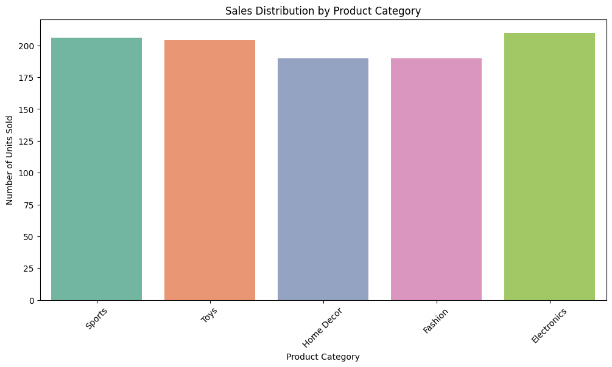

# 📊 E-commerce Sales Data Analysis and Business Insights

---

## 📚 Project Overview

This project performs **Exploratory Data Analysis (EDA)** on an E-commerce sales dataset.  
The primary goal is to **understand customer and sales behavior**, uncover patterns across different product categories and customer segments, and generate **business insights** that can help optimize marketing and sales strategies.

---

## 🔎 Key Objectives

- Analyze how sales vary across product categories and customer segments.
- Investigate the impact of price, discount, and marketing spend on sales performance.
- Identify patterns, trends, and opportunities for business improvement.

---

# 📈 Exploratory Data Analysis (EDA) and Insights

---

## 1. Correlation Matrix

📊 **Insight:**  
The correlation matrix shows very weak or no correlation between Price, Discount, Marketing Spend, and Units Sold.  
Thus, feature-target linear relationships are extremely weak.

---

## 2. Sales Distribution by Product Category

📊 **Insight:**  
Electronics and Sports categories have slightly higher total sales, but overall sales are relatively balanced across different product categories.

---

## 3. Price Distribution

📊 **Insight:**  
Product prices are widely distributed between $0 and $1000, with no major skewness observed.  
Multiple price ranges are popular, indicating varied pricing strategies.

---

## 4. Discount Distribution

📊 **Insight:**  
Discount rates are spread across 0%–50%.  
Most discounts fall between 20%–40%, suggesting aggressive but controlled discounting strategies.

---

## 5. Sales by Customer Segment

📊 **Insight:**  
Occasional and Regular customers drive most of the sales, with Premium customers contributing slightly less.

---

## 6. Marketing Spend vs Units Sold

📊 **Insight:**  
There is no clear trend between marketing spend and units sold.  
Higher marketing spend does not guarantee a higher number of units sold.

---

## 7. Sales Trends Over Time

📊 **Insight:**  
Units sold fluctuate significantly over time without any strong seasonal pattern.  
Sales spikes appear random rather than periodic.

---

## 8. Sales Distribution by Product Category and Customer Segment

📊 **Insight:**  
Sales are fairly evenly distributed among customer segments within each product category, though minor variations exist.

---

## 9. Boxplot of Price by Product Category

📊 **Insight:**  
All product categories exhibit a wide range of pricing, with no single category consistently high-end or low-end.

---

## 10. Pairplot of Numerical Features

📊 **Insight:**  
No strong linear relationships between numerical features are visible.  
Scatter plots confirm wide data dispersion.

---

## 11. Distribution of Marketing Spend by Customer Segment

📊 **Insight:**  
Marketing spend levels are quite similar across all customer segments, suggesting no segment-targeted marketing focus.

---

## 12. Units Sold Over Time by Product Category

📊 **Insight:**  
Sales trends are volatile across product categories with no category consistently dominating over time.

---

## 13. Discount Distribution by Product Category

📊 **Insight:**  
Toys and Fashion categories offer slightly higher discounts on average compared to other product categories.

---

---

## 📋 Key Findings

- 🔵 No strong predictive relationship between available features and Units Sold.
- 🔵 Sales are distributed relatively evenly across different product categories.
- 🔵 Prices and discounts are spread widely, suggesting varied pricing and promotion strategies.
- 🔵 Marketing spend levels do not guarantee higher sales.
- 🔵 No significant seasonality detected in sales over time.

---

## 🛠 Future Opportunities

- Engineer features like **effective price after discount**.
- Introduce **time-based features** (month, holiday seasonality).
- Collect **product-level metadata** (brand popularity, customer ratings).
- Investigate external factors such as **promotional events** or **competitor actions**.

---

## 📂 Tech Stack

- Python
- Pandas
- Seaborn
- Matplotlib

---

## 📑 Project Files

- [Ecommerce_Sales_analysis.ipynb](assets/Ecommerce_Sales_analysis.ipynb) — Main Notebook
- [Ecommerce_Sales_Prediction_Dataset.csv](assets/Ecommerce_Sales_Prediction_Dataset.csv) — Dataset
- [README.md](README.md) — Project Overview and Documentation

